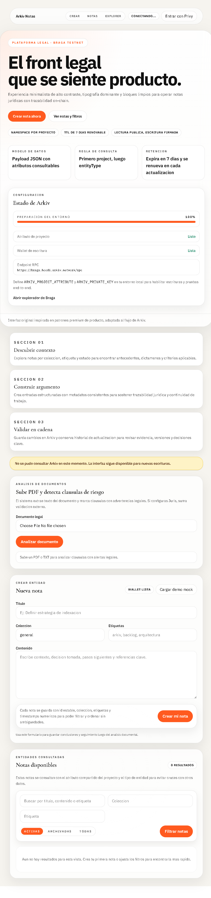
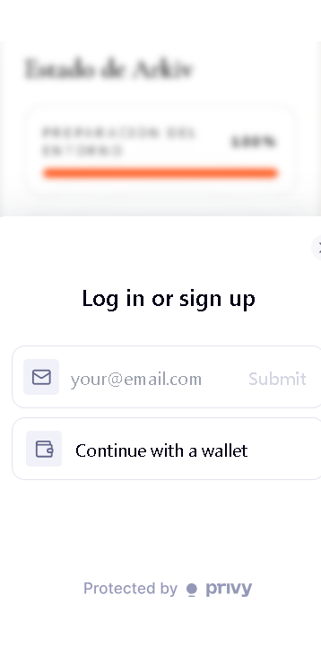
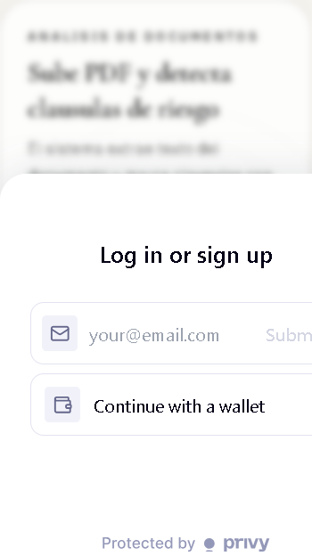
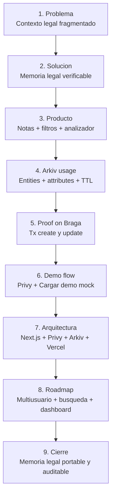

# Arkiv Notas MVP

Memoria legal verificable: crea, consulta y analiza documentos con trazabilidad
on-chain sobre Arkiv Braga.

## Contexto hackathon

Proyecto preparado para la track de IA sobre Arkiv del hackathon:

- Repo oficial del hackathon: https://github.com/Arkiv-Network/arkiv-puna-tech-hackathon
- Guia para builders: https://github.com/Arkiv-Network/arkiv-puna-tech-hackathon/blob/main/docs/builders-guide.md
- Reglas oficiales: https://github.com/Arkiv-Network/arkiv-puna-tech-hackathon/blob/main/RULES.md
- Rubrica de evaluacion: https://github.com/Arkiv-Network/arkiv-puna-tech-hackathon/blob/main/docs/scoring-rubric.md
- Formulario de entrega: https://forms.arkiv.network/punatech26
- Discord Arkiv: https://discord.gg/arkiv

## Que demuestra este proyecto

- Uso real de Arkiv como capa de datos para una app IA/web.
- Flujo CRUD de notas con estado y consultas.
- Analisis legal de documentos con reglas locales y fallback de endpoints externos.
- Login con Privy para onboarding rapido.
- Demo desplegada en Vercel y accesible por URL publica.

## Demo mock en la pagina

En el bloque "Nueva nota" hay un boton llamado "Cargar demo mock".

- Ese boton ejecuta una accion de servidor que crea notas legales de ejemplo en Arkiv.
- Sirve para poblar rapido el feed y mostrar el flujo sin cargar todo manualmente.
- Requiere entorno Arkiv completo (atributo de proyecto + wallet de escritura).

URL de demo: https://arkiv-notes-mvp.vercel.app

## Demo visual paso a paso

### 1) Vista general del producto



### 2) Entorno Arkiv listo para escribir



### 3) Carga rapida de casos con demo mock


### 4) Analisis legal de PDF y TXT



## Proof de transacciones en Braga

Proyecto de pruebas usado: `arkiv-notes-mvp-prod-20260530`

Prueba ejecutada con script de proof (create + update) sobre Braga testnet:

- Note ID: `48d7b356-b05b-4235-80ee-42b3c335d3f6`
- Entity Key: `0xebc72ce204d1076999afc80a64e8edf9b5679a13e3050513ddf3cda2815467bb`
- Create tx hash: `0x483e2056572993e273183a3e882fdefa33926f673b0bf88eede2281a2ec77cd7`
- Update tx hash: `0xe59e57f49874746bd6af6ccdf720a5e007d543fa438b338c504d897a9207f111`

Links de verificacion:

- https://explorer.braga.hoodi.arkiv.network/tx/0x483e2056572993e273183a3e882fdefa33926f673b0bf88eede2281a2ec77cd7
- https://explorer.braga.hoodi.arkiv.network/tx/0xe59e57f49874746bd6af6ccdf720a5e007d543fa438b338c504d897a9207f111

## Checklist de entrega (hackathon)

Antes de enviar, verificar:

1. Repo publico en GitHub.
2. Demo funcional desplegada por URL y conectada a Arkiv testnet.
3. Video publico mostrando el flujo completo.
4. Pitch en espanol.
5. Form de entrega completado: https://forms.arkiv.network/punatech26

## Pitch deck

- Deck editable (Markdown): [docs/pitch-deck.md](docs/pitch-deck.md)
- Repo del proyecto: https://github.com/melyteo/arkiv-notes-mvp

## Pitch deck grafico (README)



Version completa slide-by-slide:

- [docs/pitch-deck.md](docs/pitch-deck.md)

## Requisitos

- Node.js 20+
- Variables de entorno en `.env.local`:
	- `ARKIV_PROJECT_ATTRIBUTE`
	- `ARKIV_PRIVATE_KEY`
	- `ARKIV_RPC_URL` (opcional)
	- `NEXT_PUBLIC_PRIVY_APP_ID` (opcional, login)
	- `PRIVY_APP_SECRET` (opcional, uso servidor)
	- `JURIS_API_KEY` (opcional, integracion legal externa)
	- `JURIS_API_URL_PRIMARY` / `JURIS_API_URL_SECONDARY` / `JURIS_REPOS` (opcional)

## Desarrollo local

```bash
npm run dev
```

Abre `http://localhost:3000` para ver la aplicacion.

## Build de produccion

```bash
npm run build
```

## Prueba de integracion Arkiv (smoke)

```bash
npm run smoke:arkiv
```

La prueba valida el flujo completo `create -> update -> archive -> restore` en Braga.

Nota: el script smoke usa TTL corto (`expiresIn: 60 * 60`) para pruebas.
El flujo normal de la app mantiene TTL de 7 dias para notas.

## Analizador legal de documentos

Desde la UI puedes subir archivos `.pdf` o `.txt` para detectar clausulas de
riesgo con reglas locales y, opcionalmente, enriquecer resultados via Juris.

El analizador:

- extrae texto del documento
- detecta hallazgos por severidad (`alta`, `media`, `baja`)
- devuelve extracto, base y sugerencia
- prueba multiples endpoints de forma automatica cuando estan configurados

## Login con Privy

Si `NEXT_PUBLIC_PRIVY_APP_ID` esta presente, la app habilita autenticacion con
Privy en el header e intenta iniciar login automaticamente al cargar sesion.

## Estructura funcional

- `src/app`: pagina, estilos y componentes de UI
- `src/app/actions.ts`: server actions para notas y analisis legal
- `src/services/notes.ts`: logica de negocio de notas
- `src/lib/notes`: esquema, normalizacion, mapeo y construccion de queries
- `src/lib/legal/analyzer.ts`: extraccion y analisis legal con fallback de endpoints
- `src/lib/arkiv.ts`: clientes Arkiv y validacion de entorno
- `scripts/smoke-arkiv-notes.mjs`: prueba end-to-end contra la red
